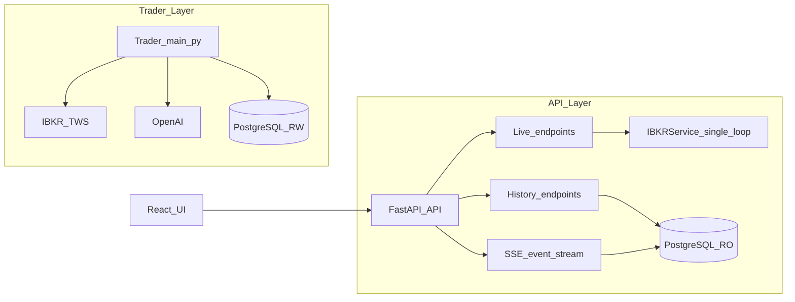

# AutoTrader Architecture (Stability-First)

This document describes how AutoTrader is structured today, the intended data ownership boundaries, and the main failure modes we’ve seen in production usage.

## High-level components

AutoTrader runs as **two Python processes** plus a **React dashboard**:

- **Trader engine** (cycle orchestrator): `main.py`
  - Connects to **IBKR** via `ib_insync`
  - Pulls market data + news + Reddit signals
  - Asks the AI for decisions (shortlist/skip; buy selection; position/order reviews)
  - Places/cancels/modifies orders and manages risk
  - Writes historical/audit data to PostgreSQL

- **API server** (read + live service): `api_server.py` → `src/api/app.py`
  - Serves **historical** data from PostgreSQL (events, research, trades, reviews, performance)
  - Serves **live** data from IBKR (positions, open orders, account values) via a dedicated service thread
  - Provides SSE (`/api/events/stream`) for the dashboard “Live stream”

- **Dashboard UI**: `frontend/` (React + Vite)
  - Polls history endpoints on a fixed interval
  - Opens an EventSource (SSE) connection to stream recent events

## Data ownership: live vs history

To make failures obvious and avoid misleading screens, we treat data sources explicitly:

- **Live (IBKR-owned)**: current positions, open orders, account values
  - Source of truth is **TWS/Gateway**.
  - If IBKR is unavailable, these endpoints should return **503** (no database snapshots, no silent `[]`).

- **History (DB-owned)**: events, research logs, trades table, position reviews, order reviews, performance
  - Source of truth is **PostgreSQL**.
  - These endpoints should remain available even if IBKR is temporarily unavailable.

## Process + module map

Key modules:
- Trader orchestration: `main.py`
- Trading execution: `src/trading/executor.py`
- Position + order review: `src/trading/position_manager.py`
- Research + screening: `src/research/*`
- Market/news/Reddit data: `src/data/*`
- DB backend selector: `src/utils/database.py`
- Postgres implementation: `src/utils/database_postgres.py`
- API entry: `api_server.py` + `src/api/app.py`
- API live IBKR service: `src/api/ibkr_service.py`

## Critical stability pressure points (observed)

### 1) `ib_insync` event loop hazards (API)
**Symptoms**: flapping connected/disconnected, empty live responses, runtime errors about “no current event loop” or “future attached to a different loop”.

**Root cause**: `ib_insync` is not thread-safe and is sensitive to event loop boundaries. Calling it from FastAPI request threads or the uvicorn loop without strict isolation causes intermittent failure.

**Mitigation/ownership**: API should use a single dedicated IBKR thread + event loop (`src/api/ibkr_service.py`) and never “connect per request”.

### 2) Ambiguous “fallbacks” hide failure
**Symptoms**: UI shows `—` or `£0.00` for cash/positions, masking the real error.

**Root cause**: returning empty lists/DB snapshots for live endpoints makes the UI look “healthy” while it is not.

**Mitigation/ownership**: live endpoints must fail loudly with **503** and a short, actionable error.

### 3) IBKR rate limiting (Error 322)
**Symptoms**: log floods like “Maximum number of account summary requests exceeded”.

**Root cause**: repeatedly calling account summary requests without unsubscribing.

**Mitigation/ownership**: use the `accountValues()` cache populated by account updates; avoid repeated account-summary subscriptions.

### 4) DB lock contention (historic pain with SQLite)
**Symptoms**: API hangs, timeouts, “database is locked” errors, UI stuck loading.

**Root cause**: SQLite is not suited for concurrent writer+reader with high write volume.

**Mitigation/ownership**: PostgreSQL is the correct baseline; keep DB sessions short-lived in the API, and avoid long transactions.

### 5) SSE fragility (serialisation + client recovery)
**Symptoms**: “Stream error” badge, EventSource disconnecting, aborted fetches.

**Root cause**:
- serialising non-JSON-safe values (e.g., `datetime`) into SSE payloads
- client not clearing stream errors on reconnect

**Mitigation/ownership**:
- server: always serialise timestamps to ISO strings
- client: clear error on `onopen` and continue streaming

## Failure modes (what “good” looks like)

- **IBKR down**:
  - Live endpoints return **503** with a concise `detail`
  - History endpoints continue working
  - UI surfaces “live data unavailable” but still shows research/history

- **DB down**:
  - `/api/health` reports `db_ok=false`
  - History endpoints fail clearly (5xx), UI shows a single atomic error banner

- **SSE down**:
  - UI shows “Stream error”, but recovers automatically once SSE reconnects
  - Polling still updates panels (degraded mode)

## Architectural debt to address next

The biggest maintainability risk is *orchestration sprawl* in `main.py` (cycle timing + risk + data collection + AI + execution + persistence). Incremental improvements should separate:
- Cycle orchestration
- Data gathering + enrichment
- Decisioning (AI)
- Execution (orders)
- Persistence + audit logging

Those boundaries make correctness and test coverage far easier without a rewrite.

